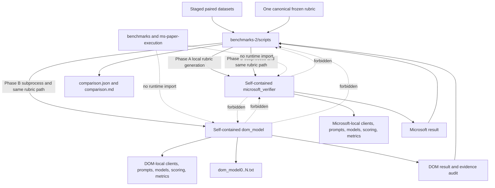

# Corrected Self-Contained Verifier Implementation Plan

> **Authoritative revision:** This section supersedes the legacy plan retained below for inspection history. The corrected structure is now implemented; the legacy section is non-operative.

## Scope and invariants

`benchmarks-2/` mirrors the original benchmark at package level and contains two complete verifier distributions: an unchanged local Microsoft screenshot verifier and an independent DOM-model verifier. The protected `benchmarks/` and `ms-paper-execution/` trees remain read-only.

- `microsoft_verifier/` is a complete byte-for-byte local copy of Microsoft's verifier, including runner, clients, prompts, relevance, top-K, evidence analysis, scoring, outcome, failure, penalties, validity, metrics, helper scripts, packaging, and tests.
- `dom_model/` independently contains those same categories of runtime code under the `dom_model` namespace.
- Neither verifier imports runtime code from `benchmarks/`, `ms-paper-execution/`, top-level `scripts/`, or the other verifier package.
- Required common verifier code is duplicated intentionally inside each distribution.
- The DOM package changes only evidence loading, relevance, and evidence analysis to consume ordered `dom_model0..N.txt` states.
- DOM-diff code is neither copied nor imported.
- Shared frozen-rubric generation and comparison orchestration remain at `benchmarks-2/scripts/`.
- Sidecars are written only into staged copies under `benchmarks-2/data/`.
- No paid generation or evaluation runs during restructuring.

## Corrected target tree

```text
benchmarks-2/
├── IMPLEMENTATION_PLAN.md
├── README.md
├── RUNBOOK.md
├── microsoft_verifier/
│   ├── README.md
│   ├── pyproject.toml
│   ├── requirements.txt
│   ├── config/endpoints.example.yaml
│   ├── scripts/verify_trajectories.py
│   ├── src/microsoft_verifier/
│   │   ├── __init__.py
│   │   ├── adapter.py
│   │   ├── agent.py
│   │   ├── models.py
│   │   ├── prompts.py
│   │   ├── rubric_agent.py
│   │   ├── runner.py
│   │   ├── trajectory.py
│   │   ├── clients/
│   │   │   ├── __init__.py
│   │   │   ├── create_utils.py
│   │   │   ├── graceful_client.py
│   │   │   ├── messages.py
│   │   │   └── wrapper.py
│   │   ├── resources/error_taxonomy_analysis.md
│   │   └── utils/
│   │       ├── __init__.py
│   │       ├── action_schema.py
│   │       ├── error_taxonomy.py
│   │       ├── metrics.py
│   │       ├── preflight.py
│   │       ├── rubric.py
│   │       └── validity.py
│   └── tests/
│       ├── test_adapter.py
│       ├── test_agent.py
│       ├── test_clients.py
│       ├── test_import_isolation.py
│       ├── test_preflight.py
│       ├── test_rubric.py
│       └── test_runner.py
├── dom_model/
│   ├── README.md
│   ├── pyproject.toml
│   ├── requirements.txt
│   ├── config/endpoints.example.yaml
│   ├── scripts/verify_trajectories.py
│   ├── src/dom_model/
│   │   ├── __init__.py
│   │   ├── adapter.py
│   │   ├── agent.py
│   │   ├── alignment.py
│   │   ├── context_packing.py
│   │   ├── evidence_backend.py
│   │   ├── instrumentation.py
│   │   ├── control.py
│   │   ├── dom_model_agent.py
│   │   ├── models.py
│   │   ├── prompts.py
│   │   ├── rubric_agent.py
│   │   ├── runner.py
│   │   ├── schemas.py
│   │   ├── state_parser.py
│   │   ├── trajectory.py
│   │   ├── trajectory_helpers.py
│   │   ├── package_manifest.py
│   │   ├── clients/
│   │   │   ├── __init__.py
│   │   │   ├── create_utils.py
│   │   │   ├── graceful_client.py
│   │   │   ├── messages.py
│   │   │   └── wrapper.py
│   │   ├── resources/error_taxonomy_analysis.md
│   │   └── utils/
│   │       ├── __init__.py
│   │       ├── action_schema.py
│   │       ├── error_taxonomy.py
│   │       ├── metrics.py
│   │       ├── preflight.py
│   │       ├── rubric.py
│   │       └── validity.py
│   └── tests/
│       ├── fixtures/
│       ├── test_adapter.py
│       ├── test_agent.py
│       ├── test_alignment.py
│       ├── test_clients.py
│       ├── test_context_packing.py
│       ├── test_evidence_analysis.py
│       ├── test_evidence_selection.py
│       ├── test_import_isolation.py
│       ├── test_preflight.py
│       ├── test_rubric.py
│       ├── test_runner.py
│       ├── test_scoring_pipeline.py
│       └── test_state_parser.py
├── scripts/
│   ├── __init__.py
│   ├── common.py
│   ├── compare_results.py
│   ├── generate_frozen_rubric.py
│   ├── normalize_results.py
│   ├── run_comparison.py
│   ├── validate_inputs.py
│   └── tests/
│       ├── conftest.py
│       ├── test_call_accounting.py
│       ├── test_dry_preflights.py
│       ├── test_frozen_workflow.py
│       ├── test_package_boundaries.py
│       ├── test_phase_a.py
│       └── test_result_comparison.py
├── data/
│   ├── data-new-screenshot/
│   └── data-new-dom-model/
├── rubrics/
├── results/
└── manifests/
    ├── microsoft_verifier.json
    └── dom_model.json
```

The optional `manifests/` directory contains hashes only, never runtime code.

## Dependency graph



Allowed dependencies are one-way: shared orchestration may invoke a verifier; a verifier cannot depend on shared orchestration or another verifier.

## Microsoft package construction

Copy all 33 inventoried files from `benchmarks/microsoft_verifier/` into `benchmarks-2/microsoft_verifier/` with identical relative paths and bytes.

1. Hash every source, resource, packaging, helper, and test file before copying.
2. Copy the full distribution.
3. Record the local manifest.
4. Prove byte equality with the read-only source.
5. Run its tests with only `benchmarks-2/microsoft_verifier/src` on the package path.
6. Block imports from `benchmarks`, `ms-paper-execution`, `dom_model`, and shared scripts.
7. Keep Microsoft runner behavior and CLI unchanged.

The copied Microsoft package is the fixed baseline used by this experiment.

## DOM-model package construction

Create a full `dom_model` distribution rather than a thin adapter.

1. Copy Microsoft's general verifier core into the `dom_model` namespace: clients, models, base prompts, rubric orchestration, scoring, retries, result wrappers, outcome, failure, penalties, validity, metrics, and utilities.
2. Rewrite package-root imports mechanically to local relative imports.
3. Preserve all copied downstream algorithms and prompts.
4. Recreate the DOM-specific parser, alignment, context packing, evidence prompts, evidence audit, adapter, and runner locally.
5. Bind only observation loading, criterion relevance, individual evidence analysis, and batched evidence analysis to DOM-model text.
6. Keep compatibility fields such as `screenshot_idx`, `screenshot_evidence`, and `post_image_earned_points` where the copied downstream scorer requires them.
7. Declare `evidence_mode: dom_model` in receipts.
8. Reject imports from Microsoft, DOM-diff, protected trees, and shared scripts.

The DOM agent may subclass its own copied `dom_model.rubric_agent.MMRubricAgent`; it may not import Microsoft's package.

## Required DOM-local capabilities

The DOM distribution independently contains:

- all client wrappers, messages, retry logic, and endpoint accounting;
- models, task/action/observation schemas, adapter, and trajectory parser;
- rubric generation and frozen-rubric validation;
- criterion ordering and denominator calculations;
- action-only scoring and conditional handling;
- relevance scoring, top-K ordering, later-state ties, and filtering;
- individual and batched evidence analysis, validation retries, and fallback;
- reality checking and whole-rubric rescoring;
- penalty and unsolicited-side-effect scoring;
- outcome verification;
- failure taxonomy and earliest-failure computation;
- trajectory-aware and independent task validity;
- metrics, tokens, calls, attempts, retries, warnings, and result writing;
- runner, helper script, packaging, configuration example, and complete tests.

Code duplication is intentional to enforce runtime independence.

## DOM-model evidence contract

```text
dom_model0 -- action 1 --> dom_model1 -- action 2 --> ... -- action N --> dom_modelN
```

- N actions require exactly N+1 nonempty UTF-8 state files.
- Numeric suffixes are contiguous from zero and parsed numerically.
- Initial and final states are always retained and scored for relevance.
- Raw text, source ordering, URLs, titles, labels, values, roles, refs, controls, dialogs, alerts, errors, tables, media labels, truncation flags, hashes, and line provenance are preserved.
- Missing DOM content is unproven, not false.
- Oversized evidence is packed at stable record boundaries.
- URL, title, snapshot/truncation metadata, dialogs, alerts, validation messages, and errors are mandatory.
- Every omission records state, line range, characters, estimated tokens, and reason.
- Relevance scale, top-K, tie behavior, filtering, retries, and analysis response schemas match the copied Microsoft behavior.

## Frozen-rubric workflow

### Phase A

`scripts/generate_frozen_rubric.py` validates paired staged datasets before constructing clients. It invokes the local Microsoft rubric workflow once, or explicitly validates an imported rubric. It writes:

- one canonical rubric under `benchmarks-2/rubrics/`;
- one generation/import metrics receipt;
- identical rubric sidecars in both staged task copies only.

Phase A calls and tokens remain setup costs.

### Phase B

`scripts/run_comparison.py` copies the rubric once into an isolated run root and passes the exact same resolved `--rubric-file` plus `--redo-eval` to both subprocess runners.

Both runners independently validate task ID, rubric hash, sidecar, criterion order, descriptions, maximum points, denominator, and unscored fields. Both scoring artifacts must report `rubric_generation_calls: 0`.

## Existing-file migration inventory

| Current file/category | Action | Corrected destination | Reason |
|---|---|---|---|
| `src/dom_model_verifier/state_parser.py` | Recreate and rename imports | `dom_model/src/dom_model/state_parser.py` | DOM-specific and independent |
| `alignment.py`, `context_packing.py`, `evidence_backend.py`, `schemas.py`, `instrumentation.py` | Recreate locally | Corresponding DOM package files | Keep all evidence behavior package-local |
| Current DOM `adapter.py` and `trajectory.py` | Recreate against local models | `dom_model/src/dom_model/` | Current files import Microsoft |
| Current DOM `agent.py` | Recreate against local rubric agent | `dom_model/src/dom_model/agent.py` | Remove forbidden inheritance edge |
| Current DOM `runner.py` | Recreate with local clients/utils/metrics | `dom_model/src/dom_model/runner.py` | Remove Microsoft and shared-script imports |
| `baseline_contract.py` | Replace, do not move | Source manifests and boundary tests | No runtime edge to protected source |
| Root `pyproject.toml` | Split, then remove | Both package-local project files | Independent install/test boundaries |
| DOM-focused root tests | Move and rewrite | `dom_model/tests/` | Verifier-local ownership |
| Current cross-import parity test | Replace | DOM scoring-contract and artifact parity tests | Must not import both packages to make DOM work |
| Workflow/accounting/comparison tests | Move | `scripts/tests/` | Shared orchestration ownership |
| Existing top-level scripts | Retain and rewrite imports | `benchmarks-2/scripts/` | Orchestrate local packages only |
| `README.md` and `RUNBOOK.md` | Rewrite | Top level | Document two standalone packages |
| `configs/README.md` | Fold into package docs, then remove | Package READMEs/config examples | Configuration belongs with distributions |
| `data/`, `rubrics/`, `results/` | Retain | Same paths | Experiment-owned data and artifacts |

## Offline verification order

1. Record protected-tree hashes.
2. Copy Microsoft and prove byte identity.
3. Run Microsoft tests in an isolated environment.
4. Build the complete DOM package under its own namespace.
5. Port DOM evidence modules and remove all cross-package imports.
6. Split tests into Microsoft, DOM, and shared-script suites.
7. Run static forbidden-import and symlink scans.
8. Install and test each package separately with the other absent.
9. Run shared-script tests.
10. Run Phase A, DOM-runner, and Phase B dry preflights using synthetic staged data.
11. Require zero LLM calls and zero result writes from all dry runs.
12. Rehash protected trees and stop.

No paid rubric generation or scoring comparison is authorized by this plan.

## Import-isolation tests

Each package must pass:

- import with only its own `src/` on `PYTHONPATH`;
- clean-environment installation/import with repository ambient paths removed;
- an import blocker for protected trees, the sibling verifier, and shared scripts;
- static scans for forbidden absolute imports;
- no symlinks into protected or sibling directories;
- runner `--help` and offline preflight while the sibling package is absent.

Shared scripts separately verify the selected local runner roots and exact shared rubric argument.

## Reporting and fairness

Both results normalize task/rubric identity, criteria, action-only points, final points, process/outcome results, penalties, failures, validity, calls, attempts, retries, tokens, and duration. DOM adds evidence selection, state hashes, warnings, packing omissions, and limitations.

Task data, action history, final answer, frozen rubric, models, thresholds, vote count, retries, and downstream scoring behavior remain controlled. Equal scores do not imply evidence equivalence.

## DOM-model limitations

DOM-model evidence cannot prove pixel-only color, typography, borders, spacing, geometry, overlap, clipping, z-order, responsive layout, unrepresented media/canvas/chart content, visual emphasis not encoded in state, omitted shadow/cross-origin content, or server-side success not exposed by the page. Missing facts remain unproven. These are non-scoring audit annotations.

## Acceptance criteria

- Both complete package directories exist.
- All 33 Microsoft distribution files are copied byte-identically.
- Microsoft has no runtime import outside its package.
- DOM has no runtime import outside its package.
- Both independently contain runner, clients, prompts, relevance, top-K, analysis, scoring, outcome, failure, penalties, validity, metrics, and tests.
- DOM changes only the evidence modality.
- One canonical rubric file is passed identically to both.
- Sidecars exist only in staged copies.
- Phase B reports zero rubric-generation calls.
- Generation usage remains separate.
- All package, boundary, script, and dry-preflight tests pass offline.
- No paid calls occur.
- Protected-tree hashes remain unchanged.

---

> **Legacy-plan notice:** The material below is retained only as historical inspection context. Where it conflicts with the authoritative corrected plan above, the corrected plan controls.

# DOM-Model Universal Verifier Implementation Plan

This plan treats the workspace's `benchmarks/` directory—the actual folder name is plural—as the read-only reference implementation. Its scripts, configurations, Microsoft verifier modules, DOM-diff implementation, adapters, runners, tests, run receipts, and reporting structure were inspected to establish the compatibility contract.

The new implementation will live in `benchmarks-2/`, outside and alongside `benchmarks/`. Microsoft's Universal Verifier remains the fixed baseline: no Microsoft verifier code and no existing benchmark file will be modified. The only intentional behavioral change is replacing screenshot/DOM-diff evidence loading and presentation with ordered `dom_model` states.

## Baseline-to-new mapping

| Component/category | Role / failure pattern | Evidence/current behavior | Planned DOM-model behavior | Files/controls/next |
|---|---|---|---|---|
| Task loading | Establishes task ID, instruction, start URL, and metadata | Accepts the existing task-data object/list shapes and normalizes `task_id`, `confirmed_task`, and `website` | Use the same normalization and canonical hashing | New compatibility wrapper; parity tests against benchmark loader |
| Final answer | Supplies predicted output, environment state, and aborted status | Loads the single final-answer file and resolves screenshot references when applicable | Load the same fields without screenshot references; preserve `final_answer`, environment fields, `is_aborted`, and token metadata | Strict schema and exactly-one-file validation |
| Action history | Builds ordered actions, thoughts, URLs, arguments, and prior errors | Parses structured JSONL and legacy textual events; normalizes click, fill, navigation, and scroll actions | Reuse the Microsoft action parsing contract and associate action `i` with `state i-1 -> state i` | Alignment receipt with action ordinals and hashes |
| Evidence loading | Supplies browser observations | Microsoft loads screenshots; existing alternate verifier loads `dom_diff1..N` | Load complete `dom_model0..N` states; do not parse them as diffs or reuse the DOM-diff adapter | New state parser and evidence backend only |
| Rubric | Defines ordered criteria and maximum points | Uses one frozen `precomputed_rubric`; scoring-time generation is forbidden | Reuse the identical rubric JSON and SHA-256 for both runs | Fail before LLM calls on missing or mismatched rubric |
| Relevance | Ranks evidence for every criterion | Scores screenshot relevance and applies the fixed top-K, threshold, and later-state tie behavior | Apply the same scoring scale, ordering, threshold, and top-K behavior to DOM-model states | Evidence-specific prompt binding with unchanged response schema |
| Evidence analysis | Extracts criterion support and discrepancies | Analyzes selected screenshots, normally batching criteria per screenshot | Analyze selected DOM-model states, normally batching criteria per state | Preserve the Microsoft analysis fields and retry/fallback policy |
| Process scoring | Scores rubric criteria and penalties | Action-only score, condition resolution, reality check, rubric rescoring, and side-effect penalties | Invoke the original Microsoft scoring methods unchanged | Inheritance/delegation plus source-hash guards |
| Outcome/failure/validity | Determines success and diagnoses failures | Uses Microsoft outcome scoring, failure taxonomy, trajectory validity, and independent task validity | Invoke the same Microsoft methods, prompts, schemas, models, retries, and fallbacks | No DOM-diff scoring or classification code imported |
| Reporting | Produces comparable results and accounting | Normalizes criteria, process/outcome scores, failure/validity, calls, retries, and provider usage | Retain the schema and add a non-scoring DOM evidence audit | New comparison runner outside `benchmarks/` |

## Non-negotiable boundaries

- No existing Microsoft verifier code will be modified.
- No existing file under `benchmarks/` will be modified.
- Microsoft's verifier remains the fixed screenshot baseline and runs through its original runner.
- The existing DOM-diff verifier will not be used as the behavioral baseline and will not be imported by the new implementation.
- The new folder changes only the evidence loader, evidence representation, and modality binding required to supply `dom_model` text.
- Rubric structure, criterion ordering, scoring formulas, conditional handling, penalties, outcome scoring, failure classification, validity checks, retries, and reporting semantics remain Microsoft-compatible.
- The objective is to reproduce the original pipeline as closely as possible while using `dom_model` instead of screenshot or DOM-diff evidence.
- This plan does not authorize code changes; implementation begins only after separate approval.

## Proposed directory structure

```text
benchmarks-2/
├── IMPLEMENTATION_PLAN.md
├── README.md
├── RUNBOOK.md
├── pyproject.toml
├── src/
│   └── dom_model_verifier/
│       ├── __init__.py
│       ├── baseline_contract.py
│       ├── schemas.py
│       ├── trajectory.py
│       ├── state_parser.py
│       ├── alignment.py
│       ├── adapter.py
│       ├── evidence_backend.py
│       ├── agent.py
│       ├── runner.py
│       └── instrumentation.py
├── scripts/
│   ├── common.py
│   ├── validate_inputs.py
│   ├── generate_frozen_rubric.py
│   ├── run_comparison.py
│   ├── normalize_results.py
│   └── compare_results.py
├── configs/
│   └── endpoint references/documentation only
├── rubrics/
│   └── newly frozen rubrics when no existing rubric is available
├── tests/
│   ├── fixtures/
│   ├── test_state_parser.py
│   ├── test_alignment.py
│   ├── test_adapter.py
│   ├── test_evidence_selection.py
│   ├── test_microsoft_scoring_parity.py
│   ├── test_result_normalization.py
│   ├── test_call_accounting.py
│   └── test_read_only_boundaries.py
└── results/
```

`benchmarks-2/` is a sibling of `benchmarks/`, not a child of it. Run inputs, temporary canonical-rubric sidecars, logs, and results will be copied into isolated run directories so neither the source dataset nor benchmark code can be affected.

## Mandatory frozen-rubric experiment pipeline

The experiment has two deliberately separate phases. Phase A creates and freezes one canonical task rubric for both modalities. Phase B uses that exact rubric to score Microsoft screenshots and DOM-model evidence. It is forbidden to generate separate modality rubrics or to generate any rubric during Phase B.

### Phase A: generate and freeze one shared rubric

The experiment will preserve the behavior and CLI contract of `benchmarks/scripts/generate_frozen_rubric.py`. The original script remains untouched and cannot be called unchanged for this dataset because its paired-input preflight imports `_ordered_dom_diffs` and requires `dom_diff1.txt` through `dom_diffN.txt`. Therefore, `benchmarks-2/scripts/generate_frozen_rubric.py` will be a parity implementation of that script whose only intentional differences are:

- accepting `data-new-dom-model/taskN` as the second paired task;
- validating `dom_model0.txt` through `dom_modelN.txt` instead of DOM-diff files;
- writing rubric artifacts and receipts under `benchmarks-2/`.

The generation workflow will be:

1. Resolve the paired screenshot and DOM-model task directories and require matching task-folder aliases.
2. Run dataset-only preflight before reading credentials or constructing clients.
3. Require identical task data, internal task ID, instruction, initial URL, semantic action sequence, final-answer text, and `is_aborted` value.
4. Require N actions to have N+1 contiguous screenshot states and N+1 contiguous DOM-model states.
5. Require the DOM-model final answer to contain no screenshot references and to retain the benchmark's DOM-only `token_usage: {}` contract.
6. Validate endpoint configuration as the benchmark does: OpenAI only, no credential-bearing fields, and exactly `gpt-5.2` plus `o4-mini`.
7. Resolve four protected outputs: `rubrics/taskN.json`, `rubrics/taskN_generation_metrics.json`, and one `task_data_with_canonical_rubric.json` provenance sidecar in each prepared modality task.
8. Refuse to overwrite any of those four artifacts unless `--overwrite` is explicitly supplied.
9. Without `--execute`, print a `ready` receipt, make zero LLM calls, and write no rubric, metric, sidecar, or result artifact.
10. With `--execute`, load the environment file without printing secrets, require `OPENAI_API_KEY`, create the canonical clients, and instrument logical calls and endpoint attempts.
11. Instantiate Microsoft's `MMRubricAgent` with the FARA action definitions, `majority_vote_instances=1`, and `redo_eval=True`.
12. Invoke Microsoft's `_generate_rubric(instruction, init_url_context)` once as the single rubric-workflow entry point.
13. Preserve Step 0a rubric generation, Step 0b dependency/reformulation checking, original output validation, and the original maximum retry behavior.
14. Validate the final rubric as an unscored rubric, calculate its positive finite denominator, and compute the canonical SHA-256 over sorted compact JSON for the rubric object.
15. Write one canonical rubric file and embed the identical rubric object into both provenance sidecars.
16. Re-run complete paired-input validation against the canonical rubric and both sidecars.
17. Write generation metrics containing task ID, rubric hash, criteria and denominator, logical calls, endpoint attempts, retries, provider token usage by model, and the final preflight receipt.

The executable Microsoft code uses `_gpt5_client` for both Step 0a generation and Step 0b dependency checking. Although the existing runbook describes the dependency check as o4-mini, this experiment will follow the executable code and record the calls actually made by each client. The o4-mini client remains configured exactly as in the benchmark generator, but it receives no attributed call unless the executed Microsoft implementation makes one.

The canonical frozen file keeps the benchmark shape:

```json
{
  "task_id": "internal-task-id",
  "precomputed_rubric": {
    "items": []
  }
}
```

Every item must have a unique nonempty `criterion`, a nonempty `description`, positive finite `max_points`, and the required unscored `justification` and `earned_points` fields. Existing values in `justification`, `earned_points`, `post_image_earned_points`, or `post_evidence_earned_points` are rejected. The total denominator must be positive and finite.

### Phase B: score both verifiers with the frozen rubric

Phase B starts only after the Phase A rubric, generation metrics, and two matching sidecars pass validation. The comparison runner never invokes rubric generation. It supplies the same canonical path to both processes:

```text
Microsoft screenshot runner --rubric-file benchmarks-2/rubrics/taskN.json
DOM-model runner           --rubric-file benchmarks-2/rubrics/taskN.json
```

Both runners must:

- load the rubric using the internal task ID;
- recompute its canonical SHA-256;
- validate the same criterion order, descriptions, maximum points, and denominator;
- reject any task-embedded rubric that differs under canonical JSON;
- merge the canonical `precomputed_rubric` into runtime task metadata before scoring;
- complete rubric and dataset checks before judge-client construction;
- retain `--redo-eval` so stale scored results are not reused;
- bypass Steps 0a and 0b, then begin the normal scoring workflow at action-only Step 0c;
- report `rubric_generation_calls: 0` in both scoring artifacts.

If the canonical rubric is missing, malformed, already scored, task-ID mismatched, sidecar-drifted, or otherwise invalid, Phase B fails closed rather than allowing `_generate_rubric` to run. An existing rubric can be reused only through an explicit canonical import/validation receipt under `benchmarks-2/`; neither verifier may silently discover a task-local fallback.

Rubric-generation calls and tokens belong only to `taskN_generation_metrics.json`. They are reported as experiment setup cost and are not mixed into screenshot or DOM-model scoring-time totals. The comparison rejects a nonzero scoring-time rubric-generation count, rubric hash drift, denominator drift, criterion order drift, or criterion maximum-point drift.

### Frozen-rubric verification tests

- Generator preflight performs zero calls and zero writes without `--execute`.
- Overwrite protection covers the rubric, generation metrics, and both sidecars.
- Step 0a/0b generation occurs once per task, never once per modality.
- Both runner command arrays contain the exact same `--rubric-file` path and `--redo-eval`.
- Both runners reject wrong task IDs and embedded-rubric drift before scoring.
- Both normalized scoring artifacts contain the same frozen-rubric SHA-256 and zero rubric-generation calls.
- Comparison rejects rubric hash, denominator, criterion order, maximum-point, or scoring-time generation drift.
- A completed Phase A receipt is required before a paid Phase B comparison.

## Input contract and parsing

Expected task layout:

```text
data-new-dom-model/taskXX/
├── task_data.json
├── web_surfer.log
├── final_answer.json
├── dom_model0.txt
├── dom_model1.txt
└── ...
```

The parser will:

1. Require UTF-8, nonempty, root-level `dom_modelN.txt` files.
2. Parse numeric suffixes numerically rather than lexicographically.
3. Require a contiguous sequence beginning at zero.
4. Reject duplicate indices, gaps, malformed filenames, symlink escapes, and unexpected screenshot or `dom_diff` evidence.
5. Retain each file's raw bytes, SHA-256, byte/line count, and a lossless model-facing text view.
6. Assign stable provenance such as `m4:L20-L37`.
7. Preserve unknown headings and records instead of discarding content the parser does not recognize.

The observed format contains structured material such as:

- `URL:` and `Title:` headers;
- snapshot size and truncation information;
- visible and additionally captured content;
- useful page actions and secondary/debug actions;
- element references, roles, names, states, hit-testability, and viewport status;
- form labels and values when exposed;
- dialogs, alerts, validation messages, page errors, and reload notices;
- media/image labels;
- tables and list ordering.

These records will remain in source order. The implementation will not compute DOM diffs, convert states into add/remove operations, or reuse DOM-diff compaction and retrieval behavior.

## State/action alignment

The canonical relationship is:

```text
dom_model0 -- action 1 --> dom_model1 -- action 2 --> ... -- action N --> dom_modelN
```

Preflight validation will enforce:

- N parsed browser actions require exactly N+1 DOM-model states.
- `dom_model0.txt` is the initial state.
- `dom_modelN.txt` is the final browser state.
- Action ordinals are contiguous and ordered.
- The task's initial URL matches the initial state URL after documented URL normalization.
- Each action's observed URL is reconciled with its post-action state URL.
- Click/fill target references, roles, and names are checked against the preceding state when those fields are present.
- Navigation URLs, fill values, scroll direction/amount, and semantic targets are retained in the action receipt.
- Absence of a value from a state is distinguished from proof that the value was not entered.
- Delayed navigation, missing URLs, masked values, and truncated states produce explicit warnings or failures according to policy; they are never silently accepted.

Structural failures—missing states, excess states, gaps, invalid JSONL, or contradictory ordinals—stop before any paid calls. For example, an input with 11 logged actions and `dom_model0` through `dom_model12` must be rejected or corrected rather than guessed into alignment.

## Criterion-relevant evidence selection

The evidence unit will be a complete browser state, not a transition or inferred diff.

1. Every state, including the initial and final states, is considered for every rubric criterion.
2. The Microsoft relevance scoring scale and response schema are retained.
3. The same maximum-evidence setting, threshold, ordering, and later-state tie-break are applied.
4. Selected states are analyzed in batches using the same criterion order and evidence-analysis fields expected by the downstream Microsoft scorer.
5. The final state is always retained in the audit corpus and evaluated for relevance. If it is not selected for a criterion, its score, rank, and omission reason are recorded.
6. State text is wrapped with non-semantic metadata identifying its ordinal and relationship to the preceding action. The original state contents remain unchanged.
7. Selection receipts record criterion index, state index, relevance score, included line ranges, source hashes, and omission reason.

For oversized states, the default is to send the complete state whenever it fits the model context. If it cannot fit:

- split only at stable section or record boundaries;
- never split a control, table row, dialog, or error record;
- retain URL/title, truncation flags, dialogs, errors, and final-state metadata as mandatory context;
- record every omitted block and estimated token count;
- mark the resulting evidence as coverage-limited;
- never interpret an omitted or unobserved fact as negative evidence.

This is a new full-state evidence adapter, not a port of the DOM-diff retrieval system.

## Retaining Microsoft scoring behavior

The new agent will import Microsoft's original verifier package read-only and delegate all non-evidence stages to it.

Only these stages receive modality-specific bindings:

- observation loading: DOM-model state instead of image;
- evidence relevance: text state instead of image attachment;
- evidence analysis: text state instead of image attachment.

The following remain Microsoft implementations:

- frozen-rubric validation and criterion structure;
- action-only scoring;
- conditional criterion resolution;
- reality checking;
- whole-rubric rescoring;
- side-effect and penalty scoring;
- denominator and conditional-point calculations;
- majority/median behavior;
- outcome scoring;
- failure classification and earliest-failure handling;
- trajectory-aware validity;
- independent task ambiguity/validity checks;
- validation retries, transport retries, and fallbacks.

The fixed controls remain the same, including the configured GPT-5.2 and o4-mini roles, rubric threshold, maximum evidence count, evidence threshold, vote count, and outcome-based success semantics.

Internal compatibility field names such as `screenshot_evidence` may be retained where Microsoft methods require them, but the run manifest will declare that their source is `dom_model`. No rubric field or score meaning will be changed.

A baseline contract module will hash the Microsoft source files and record their hashes in every run. It will fail closed if the tested baseline differs from the pinned version. Tests will also confirm that inherited scoring methods resolve directly to Microsoft's classes and that the new package has no imports from the DOM-diff verifier.

## Frozen rubric handling

- Scoring always consumes one already-frozen rubric.
- The same rubric object, criterion order, descriptions, maximum points, and canonical SHA-256 must be used by screenshot and DOM-model runs.
- Rubric hashes and denominators are checked before client construction.
- Rubric generation calls during scoring are forbidden and treated as invalid-run evidence.
- Where an existing benchmark rubric applies, it is referenced read-only.
- Where a new task lacks a rubric, a separate explicit freeze command will invoke the Microsoft rubric-generation path with the same task metadata and model controls.
- Newly generated rubrics will be written under `benchmarks-2/rubrics/`, never under `benchmarks/`.
- Rubric generation remains an explicitly authorized paid phase, separate from comparison execution.

## Comparison runner

The new runner will preserve the benchmark's control-plane behavior:

1. Validate the screenshot and DOM-model datasets together.
2. Verify identical task ID, instruction, initial URL, final-answer content, aborted status, action count/order, and frozen rubric.
3. Compare normalized action signatures while allowing representation-specific targeting, such as screenshot coordinates versus DOM-model element references.
4. Copy both inputs and the frozen rubric into an isolated run root.
5. Run Microsoft's original screenshot runner first, unchanged.
6. Run the new DOM-model verifier as a separate process.
7. Stop the comparison if either run fails or drifts from fixed controls.
8. Normalize both outputs into the same comparison schema.
9. Generate `comparison.json` and `comparison.md`.

A comparison will not be produced from a DOM-model task alone when no controlled screenshot counterpart exists.

## Result layout

```text
benchmarks-2/results/taskXX/<run-id>/
├── run_manifest.json
├── _inputs/
│   ├── screenshot/
│   ├── dom_model/
│   └── frozen_rubric.json
├── microsoft_verifier/
│   ├── result.json
│   ├── run.log
│   └── run_metrics.json
├── dom_model_verifier/
│   ├── result.json
│   ├── evidence_audit.json
│   ├── run.log
│   └── run_metrics.json
├── comparison.json
└── comparison.md
```

## Fairness controls

Both modes will hold constant:

- logical task and instruction;
- initial URL;
- ordered action history;
- final answer and aborted status;
- frozen rubric and rubric hash;
- criterion order and maximum points;
- model endpoints and model roles;
- thresholds, vote count, retry policy, and success definition;
- process, outcome, failure, and validity schemas.

The comparison will report separately:

- action-only score per criterion;
- screenshot-supported final score per criterion;
- DOM-model-supported final score per criterion;
- criterion maximum points and score delta;
- process score and denominator;
- outcome result;
- penalty criteria;
- failure classification and earliest failure;
- trajectory and task validity;
- evidence coverage and modality limitations.

Equal total scores will not be presented as proof that the modalities supplied equivalent evidence. Evidence agreement and score agreement are separate results.

## Calls, tokens, warnings, and omissions

Each run will record:

- logical LLM calls by verifier stage and model role;
- endpoint attempts;
- transport retries;
- schema/validation retries;
- fallback invocations;
- provider-reported prompt, completion, and reasoning tokens;
- total provider tokens, with reasoning treated as a subset of completion;
- estimated input tokens for every DOM-model state and packed request;
- selected and omitted states or blocks;
- state hashes and line provenance;
- parser warnings and unrecognized sections;
- URL or action-alignment warnings;
- source-declared truncation and hidden-action notices;
- context-limit omissions;
- evidence limitations and unsupported assertions;
- raw outputs and intermediate Microsoft verifier results.

Estimated evidence tokens will remain separate from provider-reported billing usage.

## DOM-model limitations

DOM-model evidence cannot reliably prove facts that are present only visually, including:

- exact colors, fonts, borders, spacing, or styling;
- pixel-level position or size;
- overlap, clipping, occlusion, or z-order;
- image, chart, canvas, video, or icon content not represented in text;
- visual emphasis or selected appearance not encoded as a control state;
- responsive layout or viewport-specific appearance;
- closed shadow DOM, cross-origin content, or transient overlays omitted by capture;
- whether content was actually visible when the state only reports offscreen or additional content;
- server-side success beyond what the captured page exposes.

Even when debug text includes bounds, it will not be treated as equivalent to pixel evidence. A missing DOM-model fact will be classified as unproven or coverage-limited, not automatically false. These annotations remain non-scoring metadata; Microsoft's original scorer still determines points from the supplied evidence.

## Verification plan

### Offline tests

- Strict filename and contiguous-index validation.
- N-action/N+1-state alignment.
- Initial and final state identification.
- URL-chain and action-target validation.
- Lossless preservation of labels, values, controls, dialogs, errors, tables, and ordering.
- Large-state context accounting and omission receipts.
- Aborted and malformed trajectory handling.
- Frozen-rubric hash, criterion, and denominator checks.
- Zero-call behavior on preflight failure.
- Logical-call, attempt, retry, and token reconciliation.
- Result normalization and comparison rendering.
- No import from the DOM-diff verifier.
- No writes under `benchmarks/`.

### Microsoft parity tests

- Feed identical synthetic post-evidence analyses into both paths and require identical condition, reality, rescore, penalty, outcome, failure, and validity outputs.
- Require identical stage ordering outside evidence loading/relevance/analysis.
- Require identical retry and fallback decisions for equivalent mocked responses.
- Verify Microsoft scoring methods are inherited or directly delegated rather than copied and altered.
- Golden-diff modality prompts so only the evidence attachment and screenshot/DOM-model terminology differ.
- Pin and report Microsoft baseline source hashes.

### Acceptance criteria

- `benchmarks/` has no changed files.
- Microsoft's original screenshot runner executes unchanged.
- The new package has no dependency on DOM-diff verifier behavior.
- Both modes use the exact same frozen-rubric hash and fixed controls.
- Every accepted task satisfies the state/action contract.
- Criterion, process, outcome, failure, and validity results normalize into the existing comparison structure.
- Calls and provider tokens reconcile exactly.
- Every evidence omission or limitation is visible in the run artifacts.
- A controlled screenshot-versus-DOM-model run can be reproduced from its manifest and isolated inputs.
