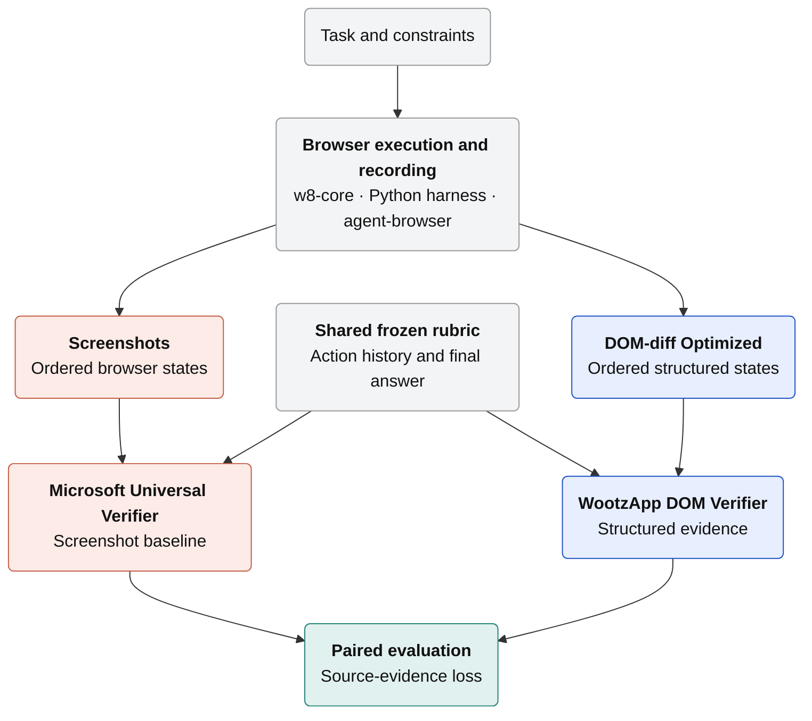

# `w8-domdiff-bench`: Browser Evidence Infrastructure for Agent Development

WootzApp

Technical report October 1, 2026

##### Abstract

We built `w8-core`, our custom Chromium-based browser infrastructure,
DOM-diff Optimized, a compact structured representation of captured page
states, and `w8-domdiff-bench`, a paired evaluation suite for browser-agent
evidence. The suite addresses a practical problem: verification cannot
recover criterion-relevant information that the recorded trajectory failed
to preserve. We use Microsoft's Universal Verifier as the screenshot-based
baseline and compare it with our DOM-based adaptation under the same task
inputs, action history, final answer, frozen rubric, and scoring controls.
The final evaluation contains one selected record for each of 100 tasks and
639 audited rubric criteria. Screenshot evidence is missing for 26/639
criteria (4.1%), compared with 2/639 (0.3%) for DOM-diff Optimized. These
results show that structured browser evidence substantially reduces
source-evidence loss in this evaluation.

### 1 Introduction

Browser-agent verification is constrained by the evidence retained during
execution. A required field may appear only after scrolling, a filter state
may be visually ambiguous, or an exact value may fall outside the captured
viewport. If the recorded trajectory omits criterion-relevant evidence,
downstream verification cannot recover it. A useful evaluation system must
therefore make evidence preservation measurable.

We built three components to make evidence preservation operational.
`w8-core` records screenshots, structured page state, and action-tool
observations within our Chromium-based browser infrastructure. DOM-diff
Optimized converts each captured state into compact, structured text while
preserving page content, controls, relationships, and scroll context.
`w8-domdiff-bench` pairs screenshot and DOM evidence from the same
trajectory, scores both against one frozen rubric, and audits source
availability directly.

Our screenshot baseline is Microsoft's Universal Verifier [[2]](#references). We retain
its rubric-based verification design, including criterion-specific relevance
selection, process and outcome scoring, and failure analysis. Our
contribution is the DOM-based adaptation, the browser-native evidence
pipeline, the paired comparison protocol, and the source-aware audit. The
acting agent receives compact text observations; screenshots are retained
for inspection and screenshot-based verification.

Across the final 100-task evaluation, DOM-diff Optimized reduces asymmetric
source-evidence loss from 26/639 audited criteria to 2/639. The result
motivates treating evidence capture and representation design as first-class
components of browser-agent evaluation.

### 2 Foundations and Baselines

Screenshot-based evaluation preserves the rendered page and is applicable to
visually grounded tasks, but extracting exact values and associating them
with rubric requirements remains a multimodal reasoning problem. WebVoyager
introduced a multimodal automatic evaluation protocol for open-ended web
tasks [[1]](#references). Microsoft's Universal Verifier develops a rubric-centered design
with process and outcome judgments, failure attribution, and
criterion-specific evidence selection [[2]](#references); we use it as the
screenshot-based baseline.

Structured browser observations are also established in browser-agent
research. WebArena exposes screenshots, HTML DOM, and accessibility-tree
observations and evaluates functional completion in controlled websites
[[4]](#references). These systems establish the value of combining rendered and
structured browser evidence; our system focuses on browser-native capture,
compact per-state representation, and paired measurement of source-evidence
loss.

### 3 Inside the WootzApp Browser Stack

#### 3.1 Building DOM-diff Optimized

We developed the browser evidence pipeline in stages, beginning with detailed
structured capture, adding action-relative change tracking, and then
replacing verbose diff artifacts with a compact representation of individual
browser states. Later work moved selection into Chromium and addressed
omissions discovered during evidence review. Table 1 summarizes the
engineering decisions behind this progression.

| Stage | Limitation addressed | Change and capability enabled |
| --- | --- | --- |
| Detailed DOM capture | Trajectory review required structured page state beyond the rendered frame. | Recorded text, attributes, element relationships, styles, accessibility data, and layout geometry for inspection. |
| DOM-diff | Detailed snapshots did not directly identify what changed after an action. | Compared pre-action and post-action states to associate actions with changes in page content and controls. |
| DOM-diff Optimized | Before/after captures repeated large amounts of unchanged content. | Reorganized each captured state into content, tables, media descriptions, controls, and scroll regions; separate diff files were no longer required. In a historical sample of 650 states, optimized text averaged 4.84 KiB, versus 44.88 KiB for detailed readable text and 191.32 KiB for structured snapshots. |
| Browser-native processing and preservation refinements | Re-reading the live page could diverge from the recorded snapshot, while selection could omit nested text, labels, control state, duplicate context, or post-scroll visibility. | Moved selection and grouping into Chromium on the captured snapshot, then refined nested-text selection, contextual deduplication, author labels, control-state capture, and visibility calculations. |
| Subtree-text-limit removal | The former 500-character subtree limit could truncate relevant nested content. | Removed the subtree-text limit to preserve relevant nested content. |

**Table 1:** Evolution of WootzApp's browser evidence pipeline. DOM-diff
tracked changes between states; DOM-diff Optimized describes individual
captured browser states. Storage figures are average stored sizes for the
documented 650-state sample and are separate from the final source-loss
evaluation.

#### 3.2 From Agent Actions to Recorded Evidence

At each step, the acting model receives compact page text, interactive
control references, task memory, and recent action outcomes. The Python
harness validates the proposed action and executes it through
`agent-browser` in the same browser tab. The resulting page becomes the next
recorded state. Browser node identifiers remain separate from executable
control references.

Each recorded state retains a screenshot, structured page evidence, readable
text, and action-tool observations. Rejected proposals are recorded
separately from executed actions.



**Figure 1:** Architecture of `w8-domdiff-bench`. An execution with $`N`$
actions yields $`N+1`$ recorded states: the initial state and one state after
each action. Screenshot and DOM-diff Optimized evidence remain separate,
while both verifiers receive the same frozen rubric, action history, and
final answer.

### 4 Benchmark Protocol

| Setting | Evaluation configuration |
| --- | --- |
| Dataset | WootzApp browser-agent task dataset. |
| Tasks | Tasks 1–100; one selected final record per task. |
| Audited criteria | 639 rubric criteria. |
| Comparison controls | Shared task inputs, executed actions, final answer, and frozen rubric, with screenshot and DOM records aligned by action step. |
| Evidence-loss metric | Defined in Section 4.2 from direct review of the ordered source states. |

**Table 2:** Essential settings for the final evaluation [[3]](#references).

#### 4.1 Task Success

For task $`t`$, the verifier assigns scores to the rubric criteria and sums
them to obtain $`S_t`$. Let $`S_t^{\max}`$ denote the full available rubric
score. The binary task verdict is

```math
\mathrm{Success}(t)=
\begin{cases}
1, & S_t=S_t^{\max},\\
0, & S_t < S_t^{\max}.
\end{cases}
```

A task therefore succeeds only when it receives the full available score
$`(x/x)`$; any lower total is classified as failure. This task-success
definition is separate from the evidence-loss metric, which measures missing
source evidence rather than agent performance or verifier accuracy.

#### 4.2 Measuring Evidence Preservation

We measure *paired source-evidence loss*: at least one required evidence item
is absent from one recorded representation but available in the other. Let
$`\mathcal{C}`$ be the audited rubric criteria, with $`M=|\mathcal{C}|`$, and
let $`\mathcal{I}_c`$ be the concrete required values or states reviewed for
criterion $`c`$. For item $`i\in\mathcal{I}_c`$, let
$`a_{c,i,S},a_{c,i,D}\in\{0,1\}`$ indicate availability in screenshots
$`(S)`$ and DOM-diff Optimized $`(D)`$, respectively, across the eligible
ordered source states. The same evidence requirements and review scope apply
to both representations [[3]](#references).

```math
\ell_{c,S}=\mathbf{1}\!\left\{\exists i\in\mathcal{I}_c:
a_{c,i,S}=0\ \land\ a_{c,i,D}=1\right\},
\qquad
\ell_{c,D}=\mathbf{1}\!\left\{\exists i\in\mathcal{I}_c:
a_{c,i,D}=0\ \land\ a_{c,i,S}=1\right\}.
```

Each indicator is binary, so a criterion contributes at most one loss per
representation even when several required items are missing. A partially
preserved criterion counts as loss when at least one specific required item
is absent from that representation and present in the other. Evidence that
is present but overlooked or misinterpreted does not count. An item absent
from both representations, or available in both, does not trigger loss. All
audited criteria remain in the denominator, and the rate for representation
$`m`$ is

```math
\mathrm{ELR}_{m}
=\frac{100}{M}\sum_{c\in\mathcal{C}}\ell_{c,m},
\qquad m\in\{S,D\}.
```

This metric measures evidence gaps between paired recorded representations.
It does not measure absolute information loss against the live webpage,
because evidence omitted from both representations is not detected. Rates
are normalized by all audited criteria and do not measure task success or
verifier accuracy.

### 5 Benchmark Results

#### 5.1 Evidence Preservation Across 100 Tasks

For Tasks 1–100, the confirmed counts are

```math
M=639,
\qquad
\sum_{c\in\mathcal{C}}\ell_{c,S}=26,
\qquad
\sum_{c\in\mathcal{C}}\ell_{c,D}=2.
```

Therefore,

```math
\mathrm{ELR}_{S}=\frac{26}{639}\times100\approx4.07\%,
\qquad
\mathrm{ELR}_{D}=\frac{2}{639}\times100\approx0.31\%.
```

```math
\text{Relative reduction}
=\frac{\mathrm{ELR}_{S}-\mathrm{ELR}_{D}}{\mathrm{ELR}_{S}}\times100
=\frac{26-2}{26}\times100
\approx92.3\%.
```

DOM-diff Optimized therefore has 92.3% fewer criteria with confirmed paired
source-evidence loss than screenshots across Tasks 1–100. This finding does
not imply a corresponding improvement in agent performance.

```mermaid
---
config:
  xyChart:
    width: 600
    height: 420
    xAxis:
      showAxisLine: false
      showTick: false
  themeVariables:
    xyChart:
      backgroundColor: "#ffffff"
      titleColor: "#111111"
      xAxisLabelColor: "#111111"
      xAxisTitleColor: "#111111"
      xAxisTickColor: "#111111"
      xAxisLineColor: "#111111"
      yAxisLabelColor: "#111111"
      yAxisTitleColor: "#111111"
      yAxisTickColor: "#111111"
      yAxisLineColor: "#111111"
      plotColorPalette: "#E76F51, #2563EB"
---
xychart-beta
    %% Layout notes: labels that look empty are zero-width spaces (U+200B), used as blank
    %% spacer slots between bar groups. The value axis starts just above 0 so that
    %% zero-value bars are not drawn at all.
    title "Evidence Preservation Across Browser Tasks"
    x-axis "Tasks 1–100 · Coral: Screenshots · Blue: DOM-diff Optimized" ["​", "​​", "4.07%", "0.31%", "​​​", "​​​​"]
    y-axis "Evidence loss (%)" 0.2 --> 5
    bar [0, 0, 4.07, 0, 0, 0]
    bar [0, 0, 0, 0.31, 0, 0]
```



**Figure 2:** Percentage of audited criteria with missing source evidence in
screenshots and DOM-diff Optimized. Lower is better.

#### 5.2 Where Evidence Is Lost

Each confirmed source gap is assigned one primary category so that the
counts in Table 3 sum to the aggregate without double counting. The
classification uses the audited criterion description and source inspection:
scalar text and values, URLs, control states, table entries, label–value
links, or capture omissions affecting a larger region or structured field
[[3]](#references).

| **Category** | **Screenshots** | **DOM-diff Optimized** |
| :--- | :---: | :---: |
| Exact text and values | 11 | 0 |
| URLs | 3 | 0 |
| Control states | 1 | 0 |
| Table entries | 1 | 0 |
| Label–value links | 0 | 1 |
| Capture omissions | 10 | 1 |
| **Total** | **26** | **2** |

**Table 3:** Category counts for confirmed source-evidence-loss criteria.
Each affected criterion appears exactly once.

```mermaid
---
config:
  xyChart:
    width: 900
    height: 480
    xAxis:
      showAxisLine: false
      showTick: false
      labelFontSize: 13
  themeVariables:
    xyChart:
      backgroundColor: "#ffffff"
      titleColor: "#111111"
      xAxisLabelColor: "#111111"
      xAxisTitleColor: "#111111"
      xAxisTickColor: "#111111"
      xAxisLineColor: "#111111"
      yAxisLabelColor: "#111111"
      yAxisTitleColor: "#111111"
      yAxisTickColor: "#111111"
      yAxisLineColor: "#111111"
      plotColorPalette: "#E76F51, #2563EB"
---
xychart-beta
    %% Layout notes: labels that look empty are zero-width spaces (U+200B), used as blank
    %% spacer slots between bar groups. The value axis starts just above 0 so that
    %% zero-value bars are not drawn at all.
    title "Evidence Loss by Type"
    x-axis "Coral: Screenshots · Blue: DOM-diff Optimized" ["Exact text and values", "​", "​​", "URLs", "​​​", "​​​​", "Control states", "​​​​​", "​​​​​​", "Table entries", "​​​​​​​", "​​​​​​​​", "Label–value links", "​​​​​​​​​", "​​​​​​​​​​", "Capture omissions", "​​​​​​​​​​​"]
    y-axis "Criteria with missing evidence" 0.4 --> 12
    bar [11, 0, 0, 3, 0, 0, 1, 0, 0, 1, 0, 0, 0, 0, 0, 10, 0]
    bar [0, 0, 0, 0, 0, 0, 0, 0, 0, 0, 0, 0, 0, 1, 0, 0, 1]
```



**Figure 3:** Confirmed source-evidence gaps by category for screenshots and
DOM-diff Optimized. Each affected criterion is assigned one primary category;
lower is better.

#### 5.3 Preserving the Details Agents Need

DOM-diff Optimized organizes captured browser content into structured
evidence that can be inspected directly. The examples below show how it
preserves exact dates, additional ranked-list entries, and endpoint URLs
missing from the corresponding screenshot records.

| Information preserved | DOM-diff Optimized | Screenshot record |
| --- | --- | --- |
| Exact release date | The exact release date is explicit. | Only a relative release date is visible. |
| Complete ranked list | Structured states preserve ranks 1–30. | Captured frames cover ranks 1–29. |
| Exact endpoint URL | The exact endpoint URL is explicit in the structured header. | The exact endpoint is not visible in the captured frames. |

**Table 4:** Preserved information from Tasks 19, 24, and 75 [[3]](#references).

Preserving these details gives developers explicit values and list entries
to inspect when reviewing agent answers and diagnosing failures. Each example
connects the agent's output to the supporting browser state.

### 6 Capabilities and Boundaries

DOM-diff Optimized cannot independently establish every visual property.
Color, typography, spacing, geometry, clipping, z-order, responsive layout,
image content, canvas state, video, and uncaptured cross-origin or shadow-DOM
content may require screenshots or additional instrumentation. Conversely,
screenshots can omit off-viewport content or render exact text and symbols
ambiguously. The two representations are complementary rather than
interchangeable.

Capture is sequential rather than atomic. DOM state, screenshots, and
action-tool observations can diverge on rapidly changing pages.
Viewport-based capture also means scrolling remains part of evidence
collection, and visibility tolerances are not identical to pixel cropping.

The evaluation covers 100 browser research and extraction tasks and 639
rubric criteria. It does not establish performance on all websites,
authenticated workflows, transactions, or visually intensive interaction.
Criterion-level audit labels can also bundle multiple facts, and manual
judgments about evidence availability and relationships remain a source of
annotation uncertainty.

For model development, the practical value is diagnostic. Source gaps
identify capture and representation work, while paired trajectories provide
inspectable records for reviewing agent behavior and candidate training
data. These uses are enabled by the system, but this report does not measure
downstream training gains or acting-agent improvement.

### 7 Building on `w8-domdiff-bench`

WootzApp built `w8-core`, DOM-diff Optimized, and `w8-domdiff-bench` to make
browser-agent evidence capture inspectable. In the final 100-task
evaluation, structured evidence reduces source-evidence loss from 26/639
criteria to 2/639. The suite provides a controlled, auditable foundation for
evaluating browser evidence, refining observations, and reviewing
trajectories while keeping confirmed source gaps separate from evidence that
was present in the recording.

**Availability.** The project repository is
[`https://github.com/wootzapp/w8-domdiff-bench`](https://github.com/wootzapp/w8-domdiff-bench).
The task dataset is
[`https://huggingface.co/datasets/WootzappLab/browser-agent-tasks`](https://huggingface.co/datasets/WootzappLab/browser-agent-tasks).
Operational setup, evaluation metadata, and artifact conventions are
maintained in the repository.

### 8 Run the Browser Harness

The runnable harness is in [`task-recorder/`](task-recorder/). From a fresh
checkout:

```bash
git clone --branch w8-reproducible https://github.com/wootzapp/w8-domdiff-bench.git
cd w8-domdiff-bench/task-recorder
python3 -m venv .venv
source .venv/bin/activate
pip install -r requirements.txt
./w8-core-runtime configure
```

Add `OPENAI_API_KEY` and `OPENAI_MODEL` to the generated `.env`, then run:

```bash
docker pull wootzapp/w8-core:latest
docker compose --env-file .env up -d --wait w8-core
./w8-core-runtime status
mkdir -p recordings
./run-task task8 --output-dir ./recordings
```

`--wait` waits for w8-core to become healthy. Add
`--no-human-intervention` to the task command when it must run unattended.
The status command prints the noVNC URL. See the
[task-recorder guide](task-recorder/README.md) for remote viewing, isolated
ports, recorded files, and troubleshooting.

### References

\[1\] Hongliang He, Wenlin Yao, Kaixin Ma, Wenhao Yu, Yong Dai, Hongming Zhang,
Zhenzhong Lan, and Dong Yu. WebVoyager: Building an end-to-end web agent with
large multimodal models. *arXiv preprint arXiv:2401.13919*, 2024. doi:
10.48550/arXiv.2401.13919. URL
[`https://arxiv.org/abs/2401.13919`](https://arxiv.org/abs/2401.13919).

\[2\] Corby Rosset, Pratyusha Sharma, Andrew Zhao, Miguel Gonzalez-Fernandez, and
Ahmed Awadallah. The art of building verifiers for computer use agents. *arXiv
preprint arXiv:2604.06240*, 2026. doi: 10.48550/arXiv.2604.06240. URL
[`https://arxiv.org/abs/2604.06240`](https://arxiv.org/abs/2604.06240).

\[3\] WootzApp. w8-domdiff-bench: Tasks 1–100 paired evaluation results. Evaluation
results and criterion-level audit records, 2026. URL
[`https://github.com/wootzapp/w8-domdiff-bench/blob/main/results.md`](https://github.com/wootzapp/w8-domdiff-bench/blob/main/results.md).

\[4\] Shuyan Zhou, Frank F. Xu, Hao Zhu, Xuhui Zhou, Robert Lo, Abishek Sridhar,
Xianyi Cheng, Tianyue Ou, Yonatan Bisk, Daniel Fried, Uri Alon, and Graham
Neubig. WebArena: A realistic web environment for building autonomous agents.
*arXiv preprint arXiv:2307.13854*, 2023. doi: 10.48550/arXiv.2307.13854. URL
[`https://arxiv.org/abs/2307.13854`](https://arxiv.org/abs/2307.13854).
